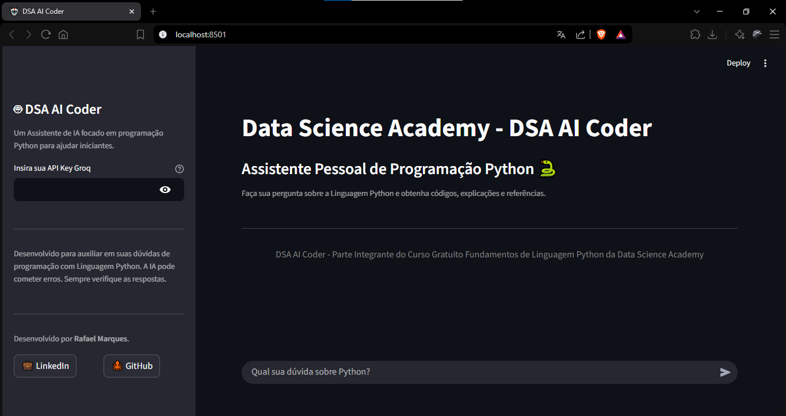

# 🤖 DSA AI Coder

Data App desenvolvido em Python com Streamlit e integração à API do Groq. Projetado para auxiliar iniciantes em programação Python. O assistente responde dúvidas sobre código, bibliotecas e boas práticas - mantendo histórico de conversa para garantir contexto contínuo.



## Índice:

- [Descrição do Projeto](#descrição-do-projeto)
- [Tecnologias Utilizadas](#tecnologias-utilizadas)
- [Baixando o Projeto](#baixando-o-projeto)
- [Obter sua API Key no Groq](#obter-sua-api-key-no-groq)
- [Como Executar](#como-executar)
- [Contato](#contato)

## Descrição do Projeto

Esse é um Estudo de Caso desenvolvido no Capítulo 2 do curso de [Fundamentos de Linguagem Python](https://www.datascienceacademy.com.br/course/fundamentos-de-linguagem-python-do-basico-a-aplicacoes-de-ia), da **Data Science Academy**.

O projeto aplica na prática conceitos de integração com LLMs via API, construção de Data Apps com Streamlit e engenharia de prompt — utilizando um prompt de sistema estruturado para garantir respostas didáticas, com exemplos de código e referências à documentação oficial do Python.

## Tecnologias Utilizadas

- Python 3.13
- Streamlit
- Groq API
- LLM: openai/gpt-oss-20b

## Baixando o Projeto

**Opção 1 — Via Git**

```bash
git clone https://github.com/rafamarqsdev24/dsa-ai-coder.git
```

**Opção 2 — Download direto**

Clique em **Code → Download ZIP**, extraia a pasta e navegue até ela pelo terminal.

## Obter sua API Key no Groq

1. Acesse o site da [Groq](https://groq.com) e crie uma conta ou faça login
2. No canto superior direito, acesse **Developers** → **Free API Key**
3. Clique em **Create API Key** e nomeie sua chave
4. Copie e guarde a chave gerada — ela não será exibida novamente

## Como Executar

> ✔ Pré-requisito: [Anaconda](https://www.anaconda.com/download) instalado na máquina.

**1. Navegue até a pasta do projeto**

```bash
cd caminho-da-pasta
```

**2. Crie o ambiente virtual**

```bash
conda create --name nome python=3.13
```

> Pressione `y` para confirmar a instalação dos pacotes.

> ℹ️ O ambiente virtual precisa ser criado apenas uma vez. Nas próximas execuções, pule para o passo de ativação.

**3. Ative o ambiente virtual**

```bash
conda activate nome
```

**4. Instale o pip e as dependências**

```bash
conda install pip
pip install -r requirements.txt
```

**5. Execute o DSA AI Coder**

```bash
streamlit run dsa_assistente.py
```

> ⚠️ Mantenha o terminal aberto durante toda a execução. Fechar o terminal encerra a aplicação.

**6. Exemplos de uso**

- Como crio um hello world em Python?
- Qual a sintaxe de um loop em Python?
- Como eu uso a função map em Python? Me dê um exemplo com lambda.

**7. Para encerrar o projeto:**

```bash
conda deactivate
```

**8. Para remover o ambiente virtual (opcional):**

```bash
conda remove --name nome --all
```

## Contato

[](https://www.linkedin.com/in/rafamarques12/) [](https://github.com/rafamarqsdev24) [](mailto:rafaelmarques.dev24@gmail.com)
